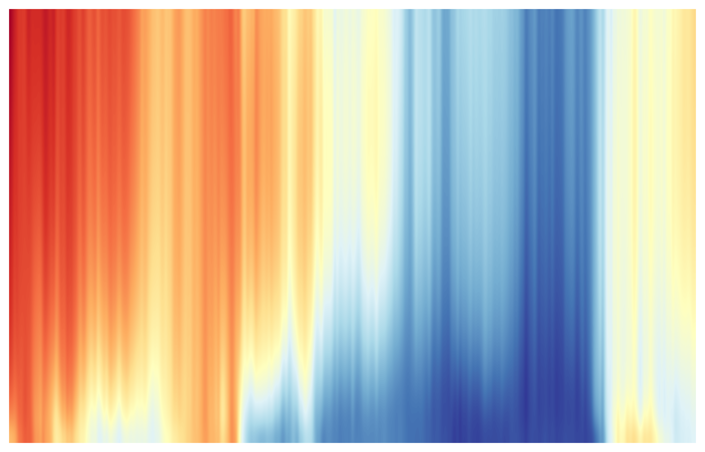

# dataviz

A small data‑visualization workspace. The first project generates a smoothed heatmap of the German government yield curve (Svensson method) using Bundesbank data.

## Yield Curve Heatmap

Location: `heatmap_yields/`

### What it does
- Downloads Bundesbank Svensson yield data (1Y–30Y)
- Cleans and merges the data into a single table
- Renders a **smoothed** heatmap (no labels/legend/title for a minimal look)
- Exports a high‑resolution PNG

### Output
- Heatmap image: [`heatmap_yields/output/yield_curve_heatmap.png`](heatmap_yields/output/yield_curve_heatmap.png)



### Run it
```bash
cd heatmap_yields
python3 -m venv .venv
source .venv/bin/activate
pip install -r requirements.txt
./generate_yield_heatmap.py
```

Optional flags:
```bash
./generate_yield_heatmap.py --start 2000-01 --end 2025-01 --pause 0
```

### Notes
- The script writes raw CSVs to `heatmap_yields/raw_csv/` and outputs to `heatmap_yields/output/`.
- `yield_curve_heatmap.png` is tracked so it renders in this README.
